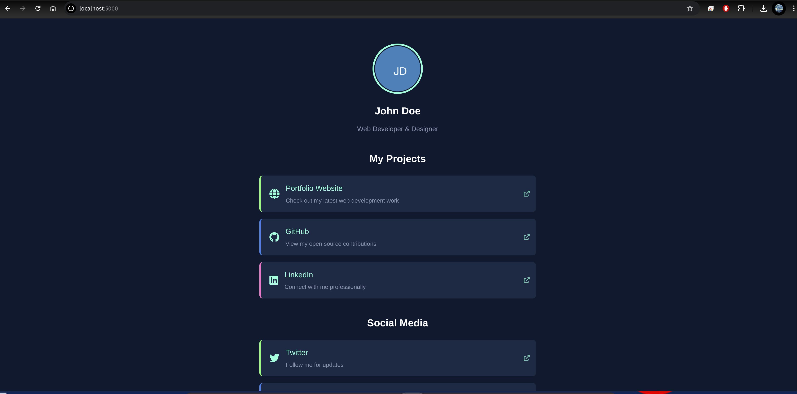

# Linktree App

[](https://opensource.org/licenses/MIT)
[](https://hub.docker.com/r/bmj2728/linktree-app)
[](https://github.com/bmj2728/linktree-app/pkgs/container/linktree-app)

A self-hosted, customizable link management page similar to Linktree. Create your own personalized landing page with organized links, custom themes, and section headings - all configurable through simple YAML files.



## Overview

This application provides a clean, customizable single-page website to organize and showcase all your important links. Perfect for social media profiles, portfolios, or any scenario where you need to share multiple links from one location.

### Why Use This?

- **Self-hosted**: Full control over your data and appearance
- **No subscription fees**: Unlike commercial alternatives
- **Customizable**: Multiple themes and easy configuration
- **Docker ready**: Easy deployment across any platform
- **Section organization**: Group links by purpose or category
- **Responsive design**: Looks great on any device

## Features

- **Simple Python Flask server** serving a single page
- **Content configurable via YAML files**
- **Card-like design** for links with icon support
- **Section headings** for organizing links
- **Link descriptions** for additional context
- **Multiple theme options** including Brian Jipson inspired theme
- **Simple theme configuration** without requiring CSS knowledge
- **Custom template support**
- **Docker support** with runtime configuration injection
- **Volume mapping** for config, custom themes, and avatar image

## Deployment Guide

### Prerequisites

- Docker and Docker Compose installed on your server
- Basic understanding of YAML file format
- A profile image (avatar) in PNG format (optional)

### Quick Deployment with Docker Compose

1. **Create the necessary directory structure**:

   ```bash
   # Create base directory for your deployment
   mkdir -p linktree-deployment
   cd linktree-deployment
   
   # Create configuration directory
   mkdir -p config
   mkdir -p templates/custom
   ```

2. **Create or download the docker-compose.yml file**:

   ```yaml
   version: '3'
   
   services:
     linktree:
       image: bmj2728/linktree-app:latest
       container_name: linktree-app
       ports:
         - "5000:5000"
       volumes:
         - ./config:/config
         - ./templates/custom:/templates/custom
       restart: unless-stopped
       environment:
         - CONFIG_PATH=/config/config.yaml
         - TEMPLATES_PATH=/templates
         - AVATAR_PATH=/config/avatar.png
   ```

3. **Create or download the configuration file**:

   ```yaml
   # Basic Information
   title: "My Links"
   name: "Your Name"
   description: "Your Description or Tagline"
   
   # Theme Configuration (options: default, dark, minimal, midnight)
   theme: "default"
   
   # Links with sections
   links:
     - title: "My Website"
       url: "https://example.com"
       icon: "fas fa-globe"
       section: "Online Presence"
       description: "Visit my personal website"
     
     - title: "GitHub"
       url: "https://github.com/yourusername"
       icon: "fab fa-github"
       section: "Online Presence"
       description: "Check out my code repositories"
   
     - title: "LinkedIn"
       url: "https://linkedin.com/in/yourusername"
       icon: "fab fa-linkedin"
       section: "Professional"
       description: "My professional profile"
   
     - title: "Contact Me"
       url: "mailto:your@email.com"
       icon: "fas fa-envelope"
       section: "Get in Touch"
       description: "Send me an email"
   
   # Additional Settings
   settings:
     animation: true
     show_social_icons: true
   ```

4. **Add your avatar image**:

   ```bash
   # Copy your avatar image to the config directory
   cp /path/to/your/avatar.png config/avatar.png
   ```

5. **Start the container**:

   ```bash
   docker-compose up -d
   ```

6. **Access your Linktree page** at `http://your-server-ip:5000`

### Alternative Deployment with Direct Docker Run

If you prefer not to use Docker Compose, you can run the container directly:

```bash
# Create the necessary directories
mkdir -p ./config ./templates/custom

# Create the config.yaml file (see step 3 above)
# Add your avatar.png file (see step 4 above)

# Run the Docker container
docker run -d \
  --name linktree-app \
  -p 5000:5000 \
  -v $(pwd)/config:/config \
  -v $(pwd)/templates/custom:/templates/custom \
  bmj2728/linktree-app:latest
```

## Customization Guide

### Modifying Your Links

Edit the `config/config.yaml` file to update your links. You can add as many links as you need, organizing them into sections:

```yaml
links:
  - title: "Link Title"
    url: "https://link-url.com"
    icon: "fas fa-icon-name"  # Font Awesome icon name
    section: "Section Name"    # Optional, for organizing links
    description: "Description text"  # Optional
```

### Available Themes

The application comes with four pre-configured themes:

| Theme | Description |
|-------|-------------|
| **default** | Clean, minimal design with blue links |
| **dark** | Dark mode theme with light text |
| **minimal** | Ultra-minimalist design with subtle styling |
| **midnight** | Dark navy theme with colored card borders, section headings, and descriptions |

To change the theme, modify the `theme` value in your `config.yaml`:

```yaml
# Theme Configuration
theme: "dark"  # Change to: default, dark, minimal, or midnight
```

### Custom Avatar

Replace the `config/avatar.png` with your own image to personalize your page:

```bash
cp /path/to/your/image.png config/avatar.png
```

For best results, use a square image (at least 300x300 pixels).

### Creating a Custom Theme

You can create your own theme by adding a YAML file to the `templates/custom` directory:

1. Create a theme configuration file:

   ```bash
   touch templates/custom/mytheme_theme_config.yaml
   ```

2. Edit the file with your custom theme settings:

   ```yaml
   # Basic colors
   background_color: "#f5f5f5"  # Page background
   container_background: "#ffffff"  # Content container background
   text_color: "#333333"  # Main text color
   description_color: "#666666"  # Description text color
   
   # Link styling
   link_style:
     background_color: "#4a86e8"  # Card background
     text_color: "#ffffff"  # Link text color
     description_color: "rgba(255,255,255,0.8)"  # Description color
     border_radius: "8px"  # Card corner roundness
     shadow: true  # Enable shadows
   
   # Card styling
   card_style:
     padding: "16px 20px"  # Internal card padding
     margin_bottom: "16px"  # Space between cards
     display_icon: true  # Show icons
     icon_color: "#ffffff"  # Icon color
     icon_size: "24px"  # Icon size
   
   # Avatar styling
   avatar_style:
     size: "120px"  # Avatar size
     border: "4px solid #ffffff"  # Avatar border
     shadow: true  # Avatar shadow
   
   # Animation
   animations:
     link_hover: true  # Hover effect
     page_load: true  # Page load animation
   ```

3. Update your `config.yaml` to use your custom theme:

   ```yaml
   # Theme Configuration
   theme: "mytheme"  # Use your custom theme name (without _theme_config.yaml)
   ```

4. Restart the container to apply the changes:

   ```bash
   docker-compose restart
   ```

## Icon Selection

The application supports [Font Awesome icons](https://fontawesome.com/icons). To use an icon:

1. Browse the Font Awesome library to find an icon you like
2. Note the icon name (e.g., `fa-github`)
3. Add the appropriate prefix to the icon name in your config:
   - For solid icons: `fas fa-[icon-name]` (e.g., `fas fa-globe`)
   - For brand icons: `fab fa-[icon-name]` (e.g., `fab fa-github`)

## Advanced Configuration

### Environment Variables

You can customize the application's behavior with these environment variables:

| Variable | Description | Default |
|----------|-------------|---------|
| `CONFIG_PATH` | Path to the configuration file | `/config/config.yaml` |
| `TEMPLATES_PATH` | Path to the templates directory | `/templates` |
| `AVATAR_PATH` | Path to the avatar image | `/config/avatar.png` |

Add these to your docker-compose.yml if you need to change the default paths.

### Custom Ports

To use a different port (e.g., port 8080 instead of 5000), modify your docker-compose.yml:

```yaml
services:
  linktree:
    # ... other settings
    ports:
      - "8080:5000"  # Maps host port 8080 to container port 5000
```

### Using a Reverse Proxy

For production use, we recommend setting up a reverse proxy (Nginx, Traefik, etc.) with HTTPS. Example Nginx configuration:

```nginx
server {
    listen 80;
    server_name links.yourdomain.com;
    
    location / {
        proxy_pass http://localhost:5000;
        proxy_set_header Host $host;
        proxy_set_header X-Real-IP $remote_addr;
    }
}
```

## Troubleshooting

### Container won't start

Check that your configuration files have the correct permissions:

```bash
chmod 644 config/config.yaml
chmod 644 config/avatar.png
```

### Theme not applying correctly

Ensure the theme name in your config.yaml matches one of the available themes or your custom theme name (without the _theme_config.yaml suffix).

### Changes not reflecting

After making changes to configuration files:

```bash
docker-compose restart
```

If that doesn't work, try rebuilding the container:

```bash
docker-compose down
docker-compose up -d
```

## License

This project is licensed under the MIT License - see the [LICENSE](LICENSE) file for details.
